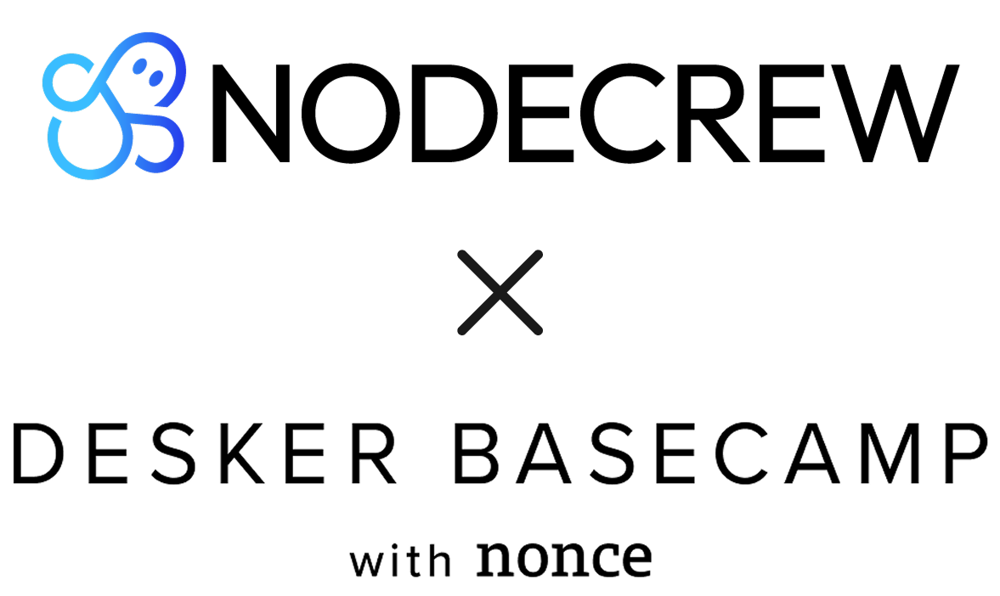

# 알고리즘 삐약이 스터디 1기 🐣

### [노션 강의자료 바로가기](https://useful-pantry-930.notion.site/28a611ac3a0080b0961ece37b42ff874?v=28a611ac3a0081bf8e2e000cb74905b0)

## 👨‍💻 주차별 활동 내용

<table>
<tr>
<td align="center" width="200">

### 📅 1주차
**10월 15일**

</td>
<td width="600">

- 📚 [활동 내용](./활동내용/1주차)
- 👥 **참여 인원**
  - 김도이 : 출석 ✅ | [과제 제출](https://github.com/Dailyalgo-Study/dailyalgo-BBIYAK-study-1/pull/3) ✅
  - 양정규 : 출석 ✅ | [과제 제출](https://github.com/Dailyalgo-Study/dailyalgo-BBIYAK-study-1/pull/10) ✅
  - 우희제 : 출석 ✅ | [과제 제출](https://github.com/Dailyalgo-Study/dailyalgo-BBIYAK-study-1/pull/8) ✅
  - 조소정 : 출석 ✅ | [과제 제출](https://github.com/Dailyalgo-Study/dailyalgo-BBIYAK-study-1/pull/4) ✅
  - 조해민 : 출석 ✅ | [과제 제출](https://github.com/Dailyalgo-Study/dailyalgo-BBIYAK-study-1/pull/6) ✅
  - 표자은 : 출석 ✅ | [과제 제출](https://github.com/Dailyalgo-Study/dailyalgo-BBIYAK-study-1/pull/9) ✅
  - 하명관 : 출석 ✅ | [과제 제출](https://github.com/Dailyalgo-Study/dailyalgo-BBIYAK-study-1/pull/5) ✅
  - 현지윤 : 출석 ✅ | [과제 제출](https://github.com/Dailyalgo-Study/dailyalgo-BBIYAK-study-1/pull/7) ✅

</td>
</tr>

<tr>
<td align="center" width="200">

### 📅 2주차
**10월 22일**

</td>
<td width="600">

- 📚 [활동 내용](./활동내용/2주차)
- 👥 **참여 인원**
  - 김도이 : 출석 ✅ | 과제 제출 ❌
  - 양정규 : 출석 ✅ | [과제 제출](https://github.com/Dailyalgo-Study/dailyalgo-BBIYAK-study-1/pull/14) ✅
  - 우희제 : 출석 ✅ | [과제 제출](https://github.com/Dailyalgo-Study/dailyalgo-BBIYAK-study-1/pull/15) ✅
  - 조소정 : 출석 ✅ | [과제 제출](https://github.com/Dailyalgo-Study/dailyalgo-BBIYAK-study-1/pull/11) ✅
  - 조해민 : 출석 ✅ | [과제 제출](https://github.com/Dailyalgo-Study/dailyalgo-BBIYAK-study-1/pull/13) ✅
  - 표자은 : 출석 ✅ | [과제 제출](https://github.com/Dailyalgo-Study/dailyalgo-BBIYAK-study-1/pull/12) ✅
  - 하명관 : 출석 ✅ | 과제 제출 ❌
  - 현지윤 : 출석 ✅ | [과제 제출](https://github.com/Dailyalgo-Study/dailyalgo-BBIYAK-study-1/pull/7) ✅
</td>
</tr>

<tr>
<td align="center" width="200">

### 📅 3주차
**10월 29일**

</td>
<td width="600">

- 📚 [활동 내용](./활동내용/3주차)
- 👥 **참여 인원**
  - 김도이 : 출석 ❌ | 
  - 양정규 : 출석 ✅ |
  - 우희제 : 출석 ✅ |
  - 조소정 : 출석 ✅ |
  - 조해민 : 출석 ✅ |
  - 표자은 : 출석 ✅ |
  - 하명관 : 출석 ❌ | 
  - 현지윤 : 출석 ✅ |

</td>
</tr>

<tr>
<td align="center" width="200">

### 📅 4주차
**11월 05일**

</td>
<td width="600">

- 📚 [활동 내용](./활동내용/4주차)
- 👥 **참여 인원**

</td>
</tr>

<tr>
<td align="center" width="200">

### 📅 5주차
**11월 12일**

</td>
<td width="600">

- 📚 [활동 내용](./활동내용/5주차)
- 👥 **참여 인원**

</td>
</tr>

</table>

## ⏳ 운영 기간 및 일정
- `기간`: **10월 15일(수) ~ 11월 12일(수), 총 5주간**
- `일정`: **매주 수요일 13:00 ~ 18:00**
- `세부 일정`: 10/15, 10/22, 10/29, 11/05, 11/12

## 🏠 모임 장소
- 서울 관악구 관악로 144, 우남네오폴리스 2층 (데스커 베이스캠프 with nonce)

## 📌 스터디 규칙

### 1️⃣ 학습 시간 및 참여 태도
- 스터디는 **꾸준한 자기 주도 학습**을 바탕으로 합니다. 주 5일 이상, 하루 최소 3시간 이상 알고리즘 학습에 시간을 투자해주세요.
- 정기 모임에 성실히 참여하며 동료들과 함께 성장하는 분위기를 만들어가는 것이 중요합니다. 💪

### 2️⃣ 과제 제출 및 코드 리뷰
- 매주 멘토의 강의가 끝난 뒤, 해당 주차에 맞는 과제가 주어집니다.
- 모든 멘티는 **주차별로 PR(Pull Request) 1개**를 제출해야 합니다. 제출 기한은 `다음 주차 모임 시작 전`까지 입니다.
- 제출하는 PR에는 **풀이한 문제의 코드와 풀이 과정 설명**을 함께 포함해주세요. 단순히 정답 코드만 제출하는 것이 아니라, 본인이 문제를 어떻게 접근했는지, 어떤 시행착오를 거쳤는지까지 기록하는 것을 권장합니다.
- 제출된 PR은 동료 멘티들과 멘토가 함께 리뷰하며, 코드의 가독성, 효율성, 다양한 접근 방식을 논의합니다.
- ✅ 구체적인 제출 방법은 **[과제 제출 방법 안내](./과제_제출_방법_안내.md)** 문서를 참고해 주세요. ✅

### 3️⃣ 출결 및 예치금 제도
- 책임감 있는 참여를 위해 스터디 시작 전 **예치금 5만원**을 납부합니다.
- 아래의 경우 예치금이 **1만원씩 차감**됩니다.
  - `사전 통보 없이 30분 이상 지각 2회 누적`
  - `무단 결석 1회`
  - `과제 미제출 1회`
- 단, 불가피한 사유가 있어 **사전에 알린 지각/결석**은 차감 대상에 포함되지 않습니다.
- 마지막 **5주차 과제**는 미제출 시에도 예치금은 차감되지 않습니다.
- 스터디 종료 후 남은 예치금은 전액 환급하며, 차감된 금액은 스터디 운영을 위한 간식 비용에만 사용됩니다.

### 4️⃣ 소통 및 협업
- **Slack** 채널을 통해 공지사항, 과제 안내, 질문/답변 등이 이루어집니다.
- 문제가 잘 풀리지 않는 경우 혼자 고민만 하기보다 적극적으로 질문하고, 다른 사람의 질문에도 기꺼이 답변해주세요.
- 코드 리뷰 시에는 비판이 아닌 성장의 기회로 삼을 수 있도록 **존중과 배려**를 기반으로 건설적인 피드백을 주고받습니다.
- 스터디는 개인 뿐 아니라 함께하는 동료들의 성장을 돕는 경험의 장입니다. 서로를 지지하며 협력하는 문화를 만들어갑시다! 🚀

 

> 알고리즘 삐약이 스터디 1기는 `(주)노드크루`와 `데스커 베이스캠프 with nonce`가 함께합니다.