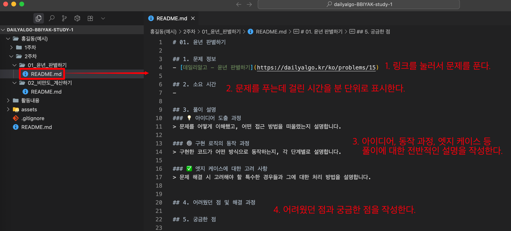

# 과제 제출 방법 안내

## 1️⃣ 스터디 레포지토리 다운로드

1. **`Code` 버튼을 클릭하고, HTTPS 링크를 복사합니다.**
    

2. **레포지토리를 다운로드하고 싶은 경로에서 터미널을 열어 아래 명령어를 입력합니다.**

   ```bash
   git clone {복사한 HTTPS 링크}
   ```

   

   

    레포지토리를 다운로드한 경로에 위와 같이 폴더가 생성되었는지 확인합니다.

3. **스터디 레포지토리 다운로드가 완료되었습니다.**


## 2️⃣ 브랜치 생성 및 이동

1. **VsCode, IntelliJ, Pycharm 등 평소 사용하는 IDE를 이용해 레포지토리를 엽니다.**

   

2. **IDE 내에서 터미널을 열어 아래 명령어를 입력해, 새로운 브랜치를 생성합니다.**

   ```bash
   git branch {새로운 브랜치 이름}
   ```

   새로운 브랜치 이름은 본인 이름과 현재 주차를 섞어 `홍길동/2주차`와 같은 형태로 지정합니다.

   >  ⚠️ 주차가 바뀔 때마다 새로운 브랜치를 생성합니다.

3. **이후 아래 명령어를 입력해 새로운 브랜치가 생성되었는지 확인합니다.**

   ```bash
   git branch --list
   ```

   

   별(*) 표시는 현재 위치한 브랜치를 의미합니다. 표시된 `main` 브랜치 이외에 본인이 생성한 브랜치가 있는지 확인합니다.

   > ⚠️ 알파벳 `q`를 누르면 원래의 터미널 화면으로 돌아갑니다.


4. **새로운 브랜치로 작업 공간을 이동합니다.**

   ```bash
   git switch {새로운 브랜치 이름}
   ```

   

​	빨간색 네모칸 부분을 통해, 작업 공간이 `main`에서 새로운 브랜치로 변경되었는지 확인합니다.

5. **브랜치 생성 및 이동이 완료되었습니다. 앞으로 알고리즘 문제에 대한 답안 및 설명은 해당 작업 공간에서 진행합니다.**


## 3️⃣ 과제 수행

1. **매주, `{본인 이름}/{주차}` 폴더에 있는 문제들을 풀고 답안 및 설명을 작성해야 합니다.**

   

   >  ⚠️ 다른 사람의 폴더를 수정하지 않도록 주의합니다.

2. **각 `{본인 이름}/{주차}/{문제}` 폴더에는 문제 정보와 여러분이 채워야할 설명 템플릿이 적혀있는 `README.md` 파일이 존재합니다.**

   

   문제 풀이 사이트(ex. 데일리알고, 백준, 프로그래머스)에서 문제를 풀고 위 순서대로 내용을 작성합니다.

   > ⚠️ `README.md`에 대한 작성 예시는 `홍길동(예시)/1주차` 폴더에 있으니 참고바랍니다.

3. **답안 코드는 문제 폴더 내에 소스 코드 파일 형태로 첨부합니다.**

   

​	답안 코드는 `C++, Java, Python` 중 하나로 작성합니다. 또한, 문제 풀이 사이트에 제출한 답안 그대로 작성합니다.

4. **나머지 문제들도 동일한 방식으로 답안 및 설명을 작성합니다.**


## 4️⃣ 과제 업로드 및 제출

1. **한 주 간의 과제를 완료하였다면, IDE에서 터미널을 열어 아래 명령어를 입력합니다.**

   ```bash
   git add .
   git commit -m "홍길동 2주차 과제 수행 완료"
   git push origin {브랜치 이름}
   ```

   커밋 메시지는 예시일 뿐이며 자유롭게 작성해도 됩니다. 또한, Git에 대해 익숙하다면 커밋을 여러 번 나눠서 저장해도 됩니다.

   > ⚠️ 현재 브랜치 이름을 기준으로 push 해야 합니다. 브랜치 이름을 잘못 기입하지 않도록 주의합니다.

2. **스터디 레포지토리에서 `Pull requests` 탭을 클릭하고 `New pull request` 버튼을 클릭합니다.**
   

3. **base는 `main`으로 유지하고, compare를 `main`에서 내 브랜치로 변경합니다.**
   

4. **커밋 및 작성 내용이 올바른지 확인한 후 `Create pull request` 버튼을 클릭하여 PR을 생성합니다.**
   

5. **PR의 제목과 내용을 작성한 후, `Create pull request` 버튼을 클릭합니다.**
   

6. **아래와 같이 나타나면 정상적으로 PR이 생성된 것입니다. 과제 제출을 완료하였습니다.**

   

​	이후 멘토가 코드 리뷰를 하면 해당 PR 상세 페이지에서 확인 가능합니다.