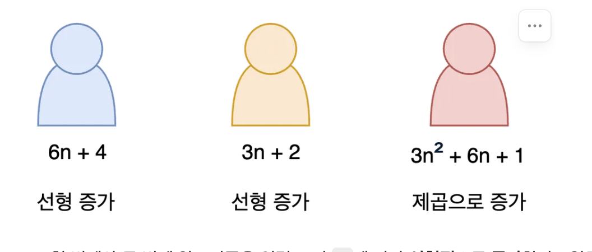
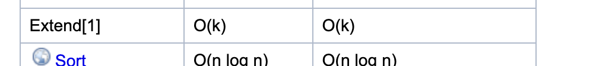
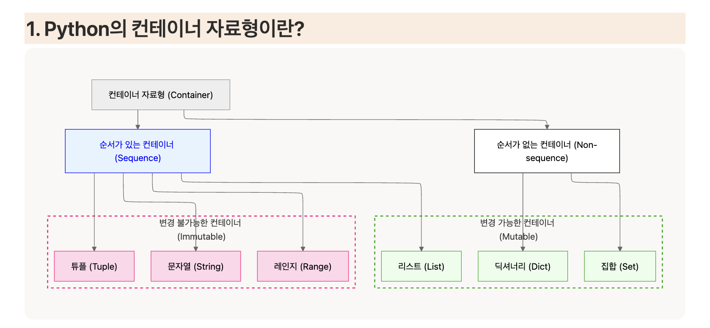

# 시간 복잡도
- 최고차항이 낮은게 시간복잡도가 낮음
- 낮은게 빠른 알고리즘

- 상수최적화
  - 같은 시간복잡도내에서도 효율/비효율을 나눈다.
- 차수는 신경 안쓰고 계수만 신경쓰면 된다.
- 시간복잡도를 예상해보는 것도 좋은 공부의 일종
- 코딩테스트에서는 1초를 기준으로 함
  - 1초에서 1억 10억번에 연산이 가능
  - n^2 = 약 5천 ~ 1만개
  - n = 천만
  - nlogN = 그 이상
  - logN = 약 20
  
- 각 메소드마다 시간복잡도가 정해져있다. 
  
  
  - 'k'-> 새로운 리스트를 의미
  - 여기서 n은 기본 리스트의 길이를 의미해서 생략

#1 container 자료형

- 코테이므로 Mutable한 자료형을 많이쓰게 된다.
- 1. **순서에 따른 분류**
    - `순서가 있는 컨테이너 (Sequence)` : 데이터를 연속된 공간에 순서대로 저장하는 컨테이너
        - ex) 리스트, 문자열, 레인지, 튜플
    - `순서가 없는 컨테이너 (Non-sequence)` : 데이터를 무작위의 순서로 저장하는 컨테이너
        - ex) 집합, 딕셔너리

