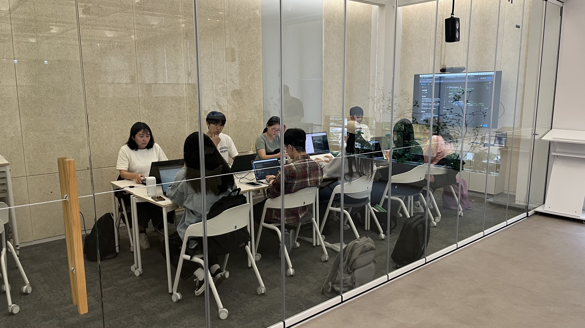
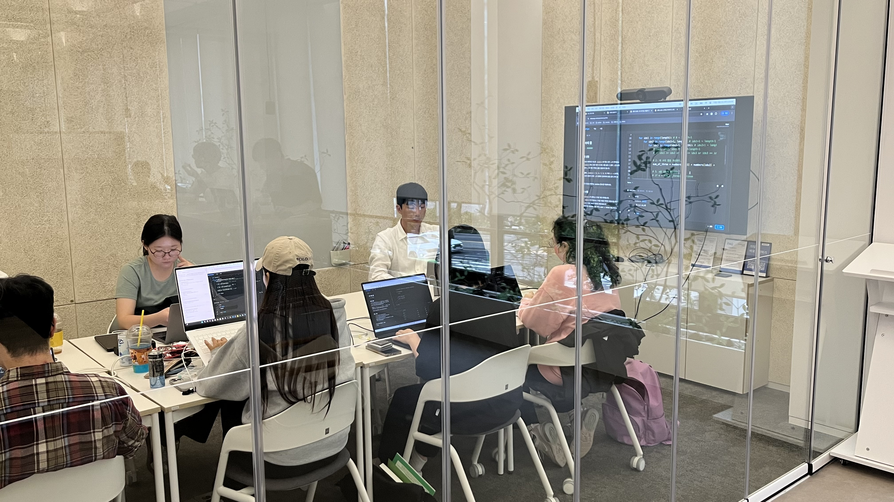
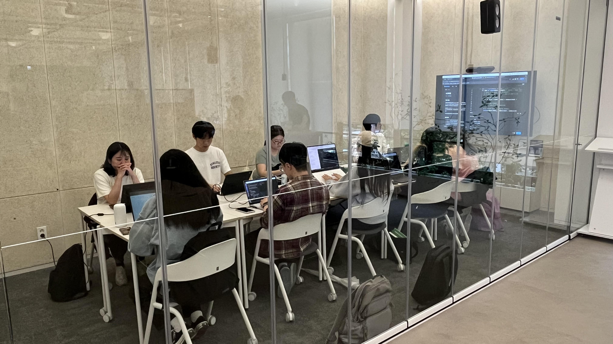
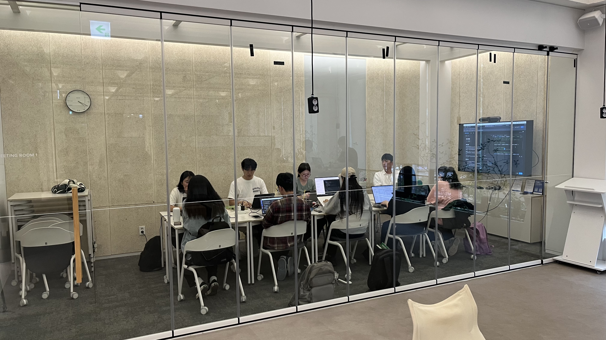

# 1주차 (10월 15일)

## 학습 내용
- 자료구조와 알고리즘
- 알고리즘의 시간 복잡도
- 빅오 표기법
- 기초 자료구조 이해하기
- 자료형 활용하기
- 더 효율적인 방법이 없는지 고민하기
- 1주차 과제
  - 두 수의 합
  - 펠린드롬 수
  - 완전제곱수 개수 세기
  - 서브블록 합의 최대와 최소 1
  - 삼각형 최소 둘레 구하기
  - 한글 숫자 읽기
  - 더 게임 오브 데스
  - 최빈값 찾기
  - 완주하지 못한 선수
  - 체스판 다시 칠하기

## 활동 사진

